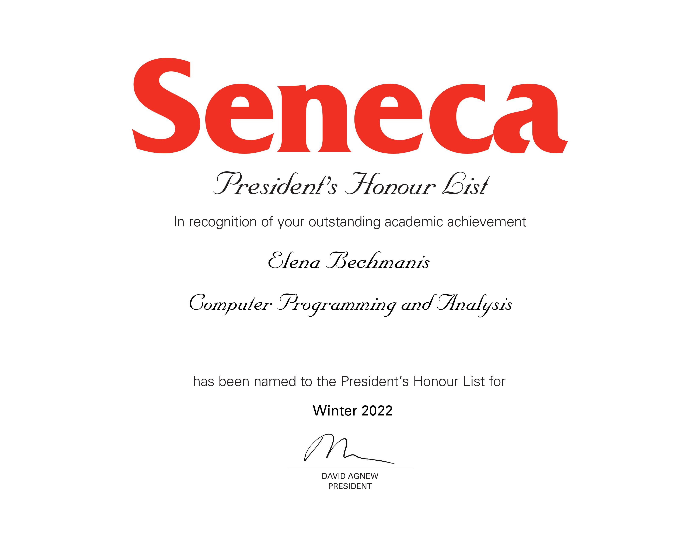

# Elena Bechmanis

 I am a full-time student at Seneca College taking Computer Programming & Analysis. For the past year, I have devoted all of my free time studying programming and I enjoy it immensely, just like I always enjoyed playing chess, solving logical puzzles, sudoku, Rubik's cube etc.
  My programming journey started with finishing Harvard's CS50 course and 1 year later I found myself in the midst of term 3 of Computer Programming/Analysis with 4.0 GPA. I also have an extensive business background and deep understanding of business processes which is really helpful when it comes to understanding the purpose of the applications I am writing and not just trying to produce a certain output. I am currently studying Advanced Database Services, Advanced Object-Oriented Software Development using C++, Web Programming Tools and Frameworks, Analysis and Design using OO models and Data Communications

So I'm a super motivated junior developer. I am looking for co-op opportunities as of January 2023 (I will be proficient in React and Data Structures/Algorithms by then as well) 🙌 I am also open to any remote part-time jobs/tasks I can help with. 

---

### Skills

 

---

### Relevant Education

**College education**
- [Seneca College Of Applied Arts & Technology](https://www.senecacollege.ca/programs/fulltime/CPA.html)

Computer Programming & Analysis, GPA 4.0, President's Honour List

to see President's Honour List certificate click here

  

   

**Web development courses**

